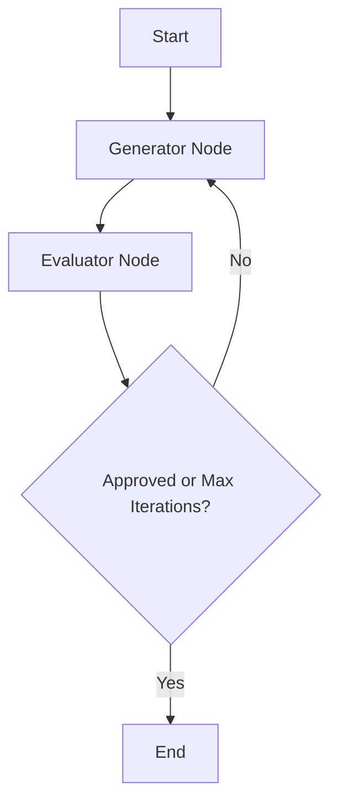

# AI Design Patterns in Python & LangGraph

A collection of practical implementations and experiments with **AI Agent Design Patterns** built using **LangGraph** and the **OpenAI API**. This repository serves as a hands-on guide for exploring architectural patterns in modern LLM systems.

---

## Implemented Patterns

### 1. Reflection Pattern (`/reflection`)

The **Reflection Pattern** establishes a self-correcting feedback loop where a generator model creates responses and an evaluator model critiques them against constraints until quality standards are met or iteration limits are reached.

#### Workflow Graph



#### Key Concepts Explored:

* **Separation of Concerns:** Splitting roles between Generation, Evaluation, and Refinement.
* **Structured Evaluation:** Enforcing JSON schema outputs for explicit criteria (`approved`, `problems`, `suggestions`).
* **State Management:** Using `LangGraph` state variables (`ReflectionState`) to track execution memory and loop boundaries.

---

## Repository Structure

```text
.
├── reflection/
│   ├── reflection.py      # OpenAI call abstractions (Generate, Evaluate, Refine)
│   └── graph.py           # LangGraph state machine definition
├── requirements.txt       # Project dependencies
└── README.md              # Documentation

```

---

## Getting Started

### Prerequisites

* Python 3.10+
* OpenAI API Key

### Setup

1. **Clone the repository**:
```bash
git clone https://github.com/your-username/ai-design-patterns.git
cd ai-design-patterns

```


2. **Environment Setup**:
```bash
python -m venv .venv
source .venv/bin/activate  # On Windows: .venv\Scripts\activate
pip install -r requirements.txt

```


3. **Configure API Key**:
```bash
export OPENAI_API_KEY="your-openai-api-key"

```


### Running the Reflection Pattern

```bash
python reflection/graph.py

```

---

## Technical Stack

* **Orchestration:** [LangGraph](https://github.com/langchain-ai/langgraph)
* **LLM Provider:** [OpenAI API](https://platform.openai.com/)
* **Type Safety:** Python `TypedDict` and type annotations
